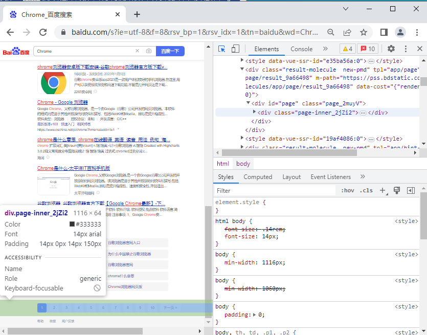

# InfoGetter

A tool for getting specified information from the Internet.
一个获取互联网指定信息的工具

##### (水参赛的作品，此程序大概率不会再被维护)

# 使用说明

 

## **程序运行环境的配置：**

1. 安装Chrome浏览器，输入Chrome://version查看浏览器版本；
2. 前往http://chromedriver.storage.googleapis.com/index.html下载相应版本的驱动解压其中的chromedriver.exe放在与程序一个目录，一般只需要大版本相同即可（也可以使用提交的作品文件中附带的浏览器驱动和安装包）。

 

## 程序各部分的参数介绍：

程序界面中，菜单栏里，文件中有载入与导出配置，字面意思。下载ChromeDriver.exe中点击指定选项即展示对应的下载链接。

主窗口中，目标地址下的方框填要抓取的地址

筛选到页数(或者滑倒底端的次数)下的方框顾名思义

先执行的操作，代表只执行一次的操作，在其下方，点击+号新增一条要执行的操作，从上到下执行。

每一条操作的4个空，分别代表：

1. 以什么类型的条件搜索
2. 搜索条件
3. 对搜索到的网页元素执行的操作，send_keys(发送文本)submit(提交表单，例如百度搜索按的那一下Enter)clear(清除文本框内容)click(点击)等待秒数
4. 执行的操作的参数，submit,clear,click可以不填

寻找页面列表，代表寻找页面的列表，注意是列表而不是单个页面的元素（如图1），在其下方，包含两个框

1. 设置搜索页面列表的条件类型，或者规定操作为滑到页面最底端
2. 搜索条件

筛选结果下，点击+号新增一条筛选操作，从上到下执行。

每一条操作的3个空，分表代表：

1. 筛选模式，寻找模式为向最后结果中添加匹配的元素，删除模式则为去除
2. 以什么类型的条件搜索
3. 搜索条件

开始获取并导出，顾名思义。

 

## **搜索条件类型及搜索条件的说明：**（图1图2可作为例子）

1. XPATH最简单的获取方式为在浏览器中按F12打开审查元素，找到对应元素，然后右键——Copy——Copy XPATH，高级用法则涉及XPATH语法
2. CLASS_NAME审查元素中找到对应元素即可获取到
3. CSS_SELECTOR涉及CSS选择器语法
4. ID同CLASS_NAME的获取方法
5. NAME同CLASS_NAME的获取方法
6. LINK_TEXT与PARTIAL_LINK_TEXT分别通过精确匹配或模糊匹配元素文本含有指定文本
7. TAG_NAME指元素的标签名，涉及HTML语法，比如审查元素中若为`<input type="hidden" value="test" name="testname">`则TAG_NAME为input

 

确保有良好的网络以在两秒内加载出网页^-^

图1

图2